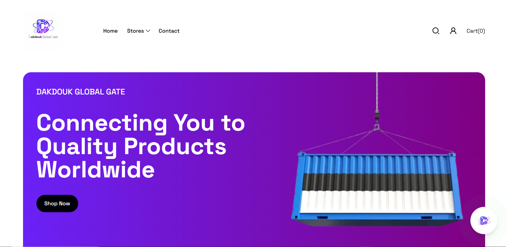
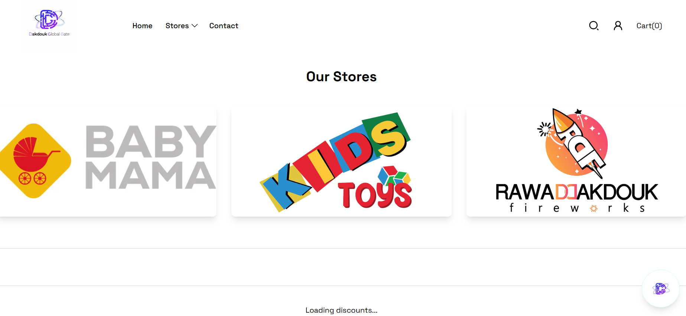
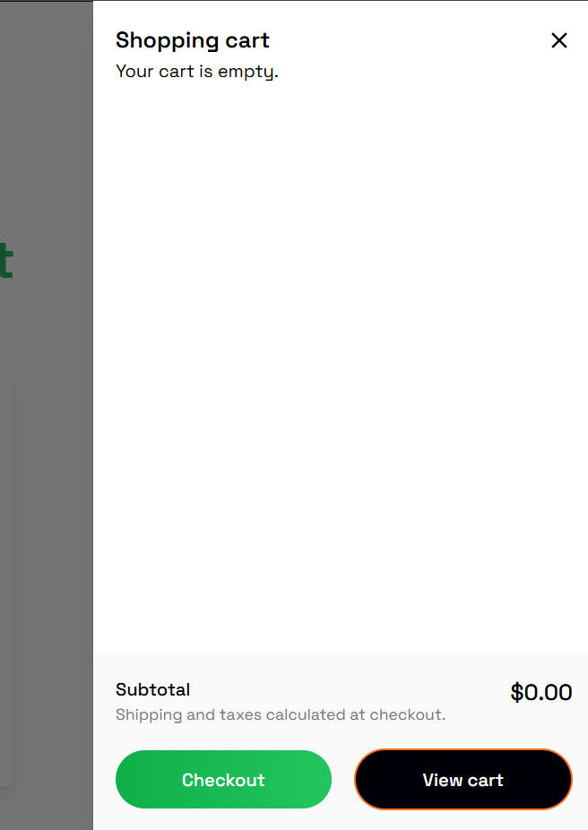
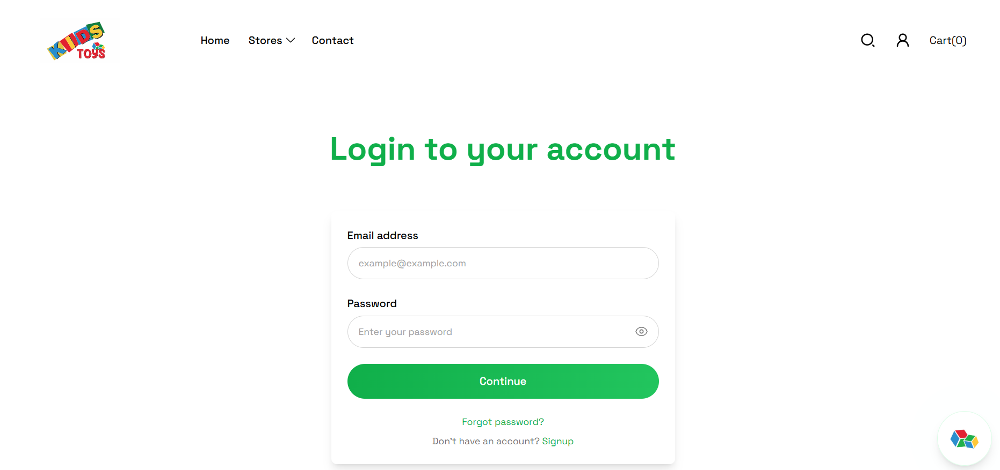
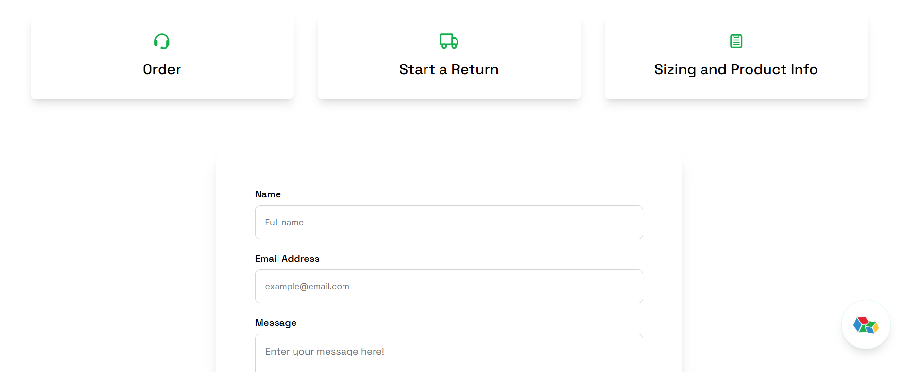

# Dakdouk Global Gate — E-Commerce Platform

A full-stack e-commerce platform built and deployed for a live retail client
in Lebanon, covering multiple product categories including clothing, fireworks,
and toys.

---

## Overview

Dakdouk Global Gate is a multi-category online store developed end-to-end for
an active retail business. The platform delivers a complete shopping experience
for customers while giving the business full control through a dedicated admin
dashboard.

The system handles everything from product browsing and cart management to
order processing, user authentication, in-app messaging, and multi-store support.

---

## Screenshots

### Home

### Stores

### Cart

### User Login

### Messaging

---

## Features

### 🛍️ Customer Side
- Multi-category product catalog (clothing, fireworks, toys)
- Multi-store browsing — explore products across different store branches
- Shopping cart with quantity management
- Full checkout and order placement flow
- 💳 Payment integration
- 👤 User registration, login, and personal order history
- 💬 In-app messaging system for customer-store communication

### 🛠️ Admin Side
- Product management — add, edit, delete, and manage stock levels
- Order management with status tracking
- User account management
- Store management across multiple branches
- Sales and order overview dashboard

---

## Tech Stack

| Layer    | Technology            |
|----------|-----------------------|
| Frontend | React                 |
| Backend  | Node.js + Express     |
| Database | MongoDB               |
| Auth     | JWT (JSON Web Tokens) |

---

## Project Status

✅ **Live in production** — actively used by a real retail client in Lebanon.

---

## Notes

This repository contains a sanitized portfolio version of the project.
All sensitive configuration, credentials, payment keys, and client-specific
data have been excluded. No real user data is present in this repository.

---

## Developer

**Robin Hmaidan** — Full-Stack Developer  
🔗 [LinkedIn](https://linkedin.com/in/robin-hmaidan-09a9a0230) · 
🐙 [GitHub](https://github.com/Robin-Hmaidan) ·
📧 robinhmiadan01@gmail.com