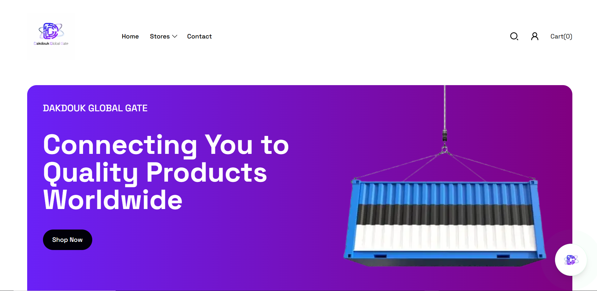
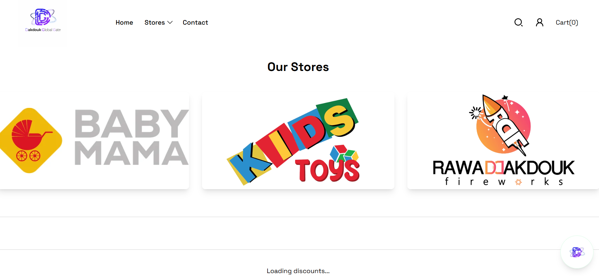
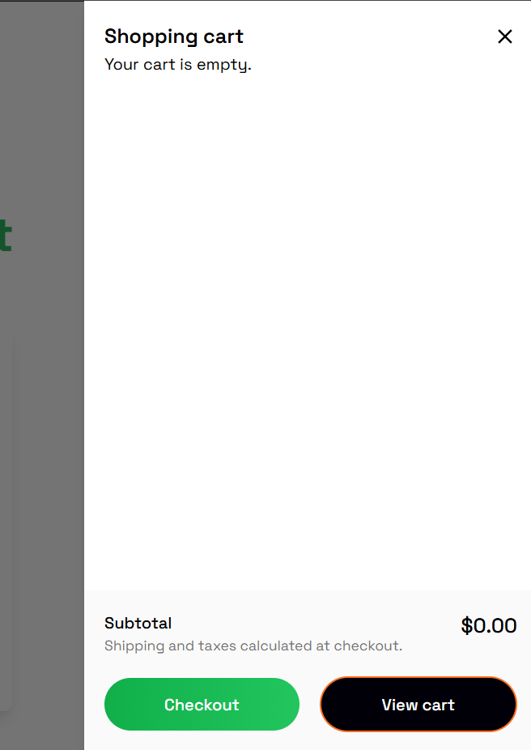
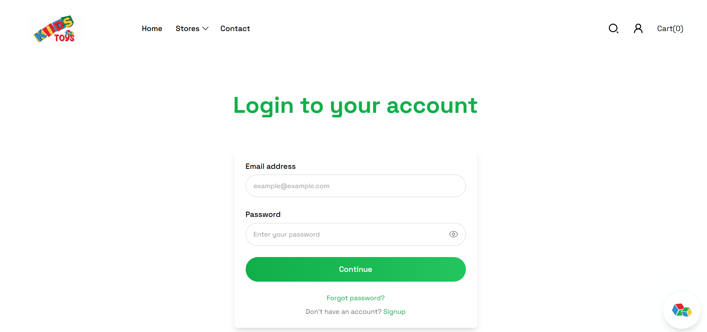
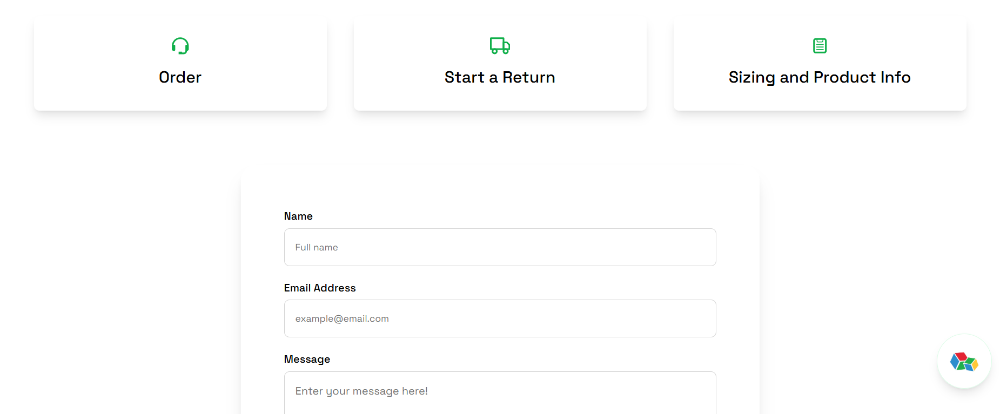

# Dakdouk Global Gate — E-Commerce Platform

An online store for a live retail client in Lebanon, covering several product categories (clothing, fireworks and toys) across multiple store branches, with a customer storefront and an admin dashboard.

**Status:** live in production &nbsp;·&nbsp; **Role:** freelance full-stack developer (2024)

> This is a sanitized portfolio version. Sensitive configuration, credentials, payment keys and client-specific data have been removed. No real user data is included.

## Overview

The client needed a single online shop for an active retail business with several branches. Customers can browse products by category and by store, manage a cart, check out and track their orders. The business manages products, stock, orders, users and stores from an admin dashboard.

I built it end to end as a freelance full-stack developer: the React storefront (product listings, cart, checkout and the delivery flow), the admin dashboard, and the Node.js/Express REST API with JWT authentication on MongoDB.

## Features

### Customer side
- Multi-category product catalog (clothing, fireworks, toys)
- Browsing across store branches
- Shopping cart with quantity management
- Checkout and order placement, with payment integration and an integrated delivery system
- Registration, login and personal order history
- In-app messaging between customers and the store

### Admin side
- Product management: add, edit, delete and manage stock levels
- Order management with status tracking
- User account management
- Store management across branches
- Sales and order overview dashboard

## Tech stack

| Layer | Technology |
|---|---|
| Frontend | React (responsive) |
| Backend | Node.js + Express, REST APIs |
| Database | MongoDB |
| Auth | JWT |

## Screenshots

### Stores

### Cart

### Customer login

### Messaging

---

Built by **Robin Hmaidan**, full-stack developer · [GitHub](https://github.com/Robin-Hmaidan) · [LinkedIn](https://linkedin.com/in/robin-hmaidan-09a9a0230) · robinhmiadan01@gmail.com
